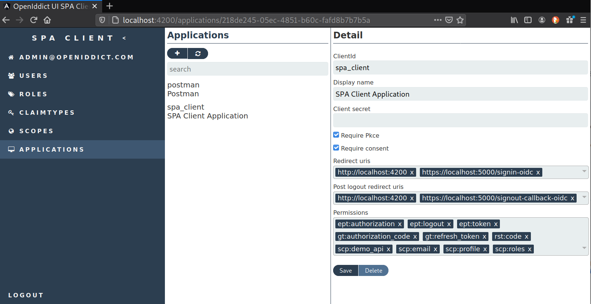

[](https://github.com/thomasduft/openiddict-ui/actions) [](https://www.nuget.org/packages/tomware.OpenIddict.UI.Api)

# OpenIddict UI

A first step to provide some headless UI features to the [OpenIddict](https://github.com/openiddict/openiddict-core) stack. 

> Please note that this project does not provide you a ready to use UI instead provides you the required services that allow you to build one. You can use the samples as a starting point though.

Currently it provides API's for managing `Scopes` and `Applications`.

On top of that it ships API's for the `Usermanagement` when using [ASP.NET Core Identity](https://docs.microsoft.com/en-us/aspnet/core/security/authentication/identity?view=aspnetcore-5.0&tabs=visual-studio).

As a goodie the samples demonstrates this features by an Angular SPA client that uses the [Authorization Code flow](https://openid.net/specs/openid-connect-core-1_0.html#CodeFlowAuth).



## Running the sample

Assuming you downloaded the sources and opened [VS Code](https://code.visualstudio.com/) in the root repo directory you should be good to go! Ahh and of course you need [.NET Core](https://dotnet.microsoft.com/download) and [node.js](https://nodejs.org/en/) installed on your development environment.

### Running the sample Server

1. Open the integrated terminal in VS Code and type

```bash
dotnet build
```

That ensures you are able to build the dotnet related stuff!

2. Go to the VS Code Debug tab (Ctrl+Shift+D) and run the Server project.

### Develop the sample Client (Angular based frontend)

1. Make sure you installed [Node.js](https://nodejs.org/en/). 

> If you develop in a [devcontainer](https://code.visualstudio.com/docs/remote/containers) then you are already good to go!

2. First run the backend (see previous chapter)

3. After the Server is running navigate within your favorite command line to the `Client` directory and type:

```bash
npm i
```

This will install all the Client's required dependencies.

```bash
npm run start
```

This will start Angular's development server.

4. Now open your browser of choice and point to the well known Angular dev url.

```bash
http://localhost:4200
```

You should see now the login screen. You can now login with the pre-configured administrator users account which is:

- E-Mail: admin@openiddict.com
- Password: Pass123$


## Using it

Follow the original setup of the OpenIddict in the `Startup.ConfigureServices(...)` - method and add your required additional extension hooks `AddUIStore(...)`, `AddUIApis(...)`, `AddUIIdentityStore(...)` and `AddUIIdentityApis<TIdentityUser>()`.

```csharp
...
services.AddOpenIddict()
  // Register the OpenIddict core components.
  .AddCore(options =>
  {
    ...
  })
  // Register the OpenIddict server components.
  .AddServer(options =>
  {
    ...
  })
  // Register the OpenIddict validation components.
  .AddValidation(options =>
  {
    ...
  })
  // Register the EF based UI Store for OpenIddict related entities.
  .AddUIStore(options =>
  {
    options.OpenIddictUIContext = builder =>
      builder.UseSqlite(Configuration.GetConnectionString("DefaultConnection"),
        sql => sql.MigrationsAssembly(typeof(Startup)
                  .GetTypeInfo()
                  .Assembly
                  .GetName()
                  .Name));
  })
  // Register the APIs for the EF based UI Store based on OpenIddict.
  .AddUIApis(options =>
  {
    // Tell the system about the allowed Permissions it is built/configured for.
    options.Permissions = new List<string>
    {
      Permissions.Endpoints.Authorization,
      Permissions.Endpoints.Logout,
      Permissions.Endpoints.Token,
      Permissions.GrantTypes.AuthorizationCode,
      Permissions.GrantTypes.Password,
      Permissions.GrantTypes.RefreshToken,
      Permissions.ResponseTypes.Code,
      Permissions.Scopes.Email,
      Permissions.Scopes.Profile,
      Permissions.Scopes.Roles,
      Permissions.Prefixes.Scope + "demo_api"
    }
  })
  // Register the EF based UI Store for the ASP.NET Identity related entities.
  .AddUIIdentityStore(options =>
  {
    options.OpenIddictUIIdentityContext = builder =>
     builder.UseSqlite(Configuration.GetConnectionString("DefaultConnection"),
       sql => sql.MigrationsAssembly(typeof(Startup)
                 .GetTypeInfo()
                 .Assembly
                 .GetName()
                 .Name));
  })
  // Register the APIs for the EF based UI Store based on ASP.NET Identity.
  .AddUIIdentityApis<ApplicationUser>();
  
...
```

## Thoughts and ideas

The project is still very young and there are a lot of ideas like:

- Provide API's for the `Authorization` and `Token` entities (if then really required).
- Provide a [ASP.NET Razor Page](https://docs.microsoft.com/en-us/aspnet/core/razor-pages/?view=aspnetcore-5.0&tabs=visual-studio) based UI.
- Possibility to manage translated display names based on supported languages etc.
